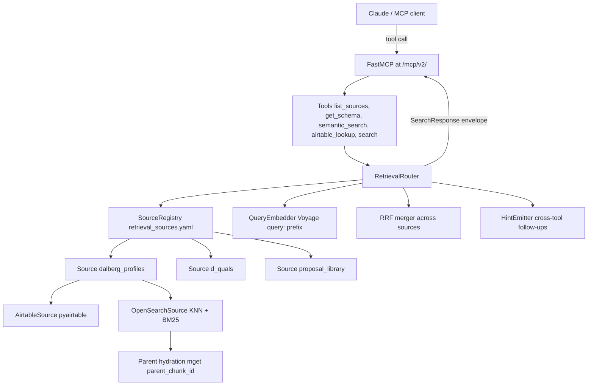
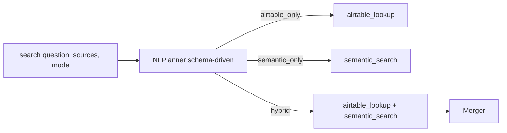

# Retrieval Module Design (merged)

## 1. Verdict on the current `pipeline/api`

**Not the right long-term shape.** It is a useful prototype but it bakes in three couplings the next phase cannot afford.

- **Source-coupled.** [`src/pipeline/api/airtable_profiles_settings.py`](src/pipeline/api/airtable_profiles_settings.py) hard-binds one base + one table from env (`AIRTABLE_BASE_ID`, `AIRTABLE_TABLE_NAME`); [`src/pipeline/api/mcp_server.py`](src/pipeline/api/mcp_server.py) names the server `"Dalberg Profiles"` and exposes only `query_dalberg_profiles` / `get_dalberg_profiles_schema`.
- **Tool-per-database trajectory.** Adding `d_quals`, `proposal_library`, `knowledge_library` would mean duplicating the entire stack per source.
- **Mixed concerns in one module.** [`src/pipeline/api/nl_airtable_query.py`](src/pipeline/api/nl_airtable_query.py) does NL planning (Claude -> formula), validation, execution, and shape classification — three jobs in one file.
- **No semantic retrieval at all.** Write path exists in [`indexer/opensearch.py`](src/pipeline/embedding_pipeline/indexer/opensearch.py) (already multi-index via `table_index_map`); read path is missing entirely.

What the prototype gets right and we keep: bearer auth ([`auth.py`](src/pipeline/api/auth.py)), FastMCP mounted at `/mcp/`, schema-snapshot validation, NL response-shape classifier ([`nl_response_shape.py`](src/pipeline/api/nl_response_shape.py)), human-readable answer formatter ([`nl_query_human_response.py`](src/pipeline/api/nl_query_human_response.py)).

## 2. Centralized service, source-specific adapters, per-source config

Each *logical source* (`dalberg_profiles`, `d_quals`, `proposal_library`, `knowledge_library`) is exactly one entry in `config/retrieval_sources.yaml`, bundling its Airtable view, its OpenSearch view, and its chunking strategy. This matches the `tables.yaml` mental model already in the repo: a "source" is the pair of Airtable rows + the OpenSearch index that mirrors them.

Adding a source = YAML edit. Adding a backend (Pinecone, Postgres) = new `RetrievalSource` adapter, no MCP tool change.



The NL convenience tool composes primitives, never reaches into adapters directly:



## 3. Folder structure (`src/retrieval/`)

```text
src/retrieval/
├── __init__.py
├── config.py                    # SourceConfig, SourceRegistry.load()
├── settings.py                  # bearer + Anthropic env (separate from per-source YAML)
├── paths.py                     # repo-root + config paths
├── models.py                    # RetrievalQuery, SearchResult, SearchResponse, Hint, ResponseMode
├── router.py                    # RetrievalRouter: fan-out via asyncio.gather
├── merger.py                    # RRF cross-source ranking
├── formatter.py                 # ResponseMode classifier + markdown table + human-readable
├── sources/
│   ├── __init__.py
│   ├── base.py                  # RetrievalSource Protocol, SchemaDescriptor
│   ├── airtable.py              # AirtableSource (generic over base + table)
│   └── opensearch.py            # OpenSearchSource (KNN + BM25 + RRF + parent hydration)
├── embedding/
│   ├── base.py                  # QueryEmbedder Protocol
│   └── voyage.py                # "query: " prefix, request-scoped cache
├── planner/
│   ├── __init__.py
│   ├── anthropic_settings.py    # lifted from api/anthropic_query_settings.py
│   ├── nl_planner.py            # NL -> {airtable_formula?, semantic_query?, filters, mode}
│   └── prompts.py               # source-agnostic system prompts, templated on schema
├── mcp/
│   ├── __init__.py
│   ├── server.py                # FastMCP build_mcp(); name "Dalberg Retrieval"
│   └── tools.py                 # five MCP tools below
└── observability/
    ├── logging.py
    └── metrics.py               # per-source latency, RRF ranks, cache hit rate
```

`config/retrieval_sources.yaml` (new) — single source of truth:

```yaml
defaults:
  embedding: { provider: voyage, model: voyage-4, query_prefix: "query: " }
  ranking:   { fusion: rrf, rrf_k: 60 }
  search_mode: hybrid                 # hybrid | semantic_only | airtable_only

sources:
  dalberg_profiles:
    display_name: "Dalberg Profiles"
    enabled: true
    description: "Dalberg employee profiles - CVs, bios, regions, business units."
    chunking_strategy: resume
    identifier_field: "Email"
    airtable:
      base_id: ${AIRTABLE_BASE_ID}
      table_name: "Dalberg Profiles"
      schema_snapshot_path: config/dalberg_profiles_schema.json
      long_text_fields: ["Bio Text", "CV Summary"]
    opensearch:
      index_name: mcp-dalberg-profiles
      k: 10
      search_mode: hybrid

  d_quals:
    display_name: "D-Quals (Project Qualifications)"
    enabled: false
    chunking_strategy: parent_child
    identifier_field: "Project ID"
    airtable: { base_id: ${AIRTABLE_BASE_ID}, table_name: "D-Quals", schema_snapshot_path: config/d_quals_schema.json }
    opensearch: { index_name: mcp-d-quals, k: 10, search_mode: hybrid }

  proposal_library: { enabled: false, ... }
  knowledge_library: { enabled: false, ... }
```

This deliberately mirrors the existing [`config/tables.yaml`](config/tables.yaml) entries so writer and reader agree on what a "source" is.

## 4. Core abstractions

```python
# retrieval/sources/base.py
class RetrievalSource(Protocol):
    name: str
    display_name: str

    async def search_semantic(self, query: str, top_k: int, filters: dict) -> list[SearchResult]: ...
    async def filter_structured(self, formula: str, fields: list[str] | None,
                                max_records: int | None) -> list[SearchResult]: ...
    def get_schema(self) -> SchemaDescriptor: ...
    def supported_filters(self) -> set[str]: ...
```

A logical source like `dalberg_profiles` may implement *both* methods (Airtable side + OpenSearch side). Internally it composes an `AirtableSource` and an `OpenSearchSource` instance from `retrieval/sources/`. The router calls one or both depending on the requested `mode`.

```python
# retrieval/models.py
@dataclass
class RetrievalQuery:
    question: str | None
    embedding: list[float] | None = None
    filters: dict[str, Any] = field(default_factory=dict)
    sources: list[str] = field(default_factory=list)        # ["dalberg_profiles"] or ["*"]
    mode: Literal["semantic_only", "airtable_only", "hybrid"] = "hybrid"
    top_k: int = 10

@dataclass
class SearchResult:
    source: str
    source_type: Literal["semantic", "structured"]
    score: float                                            # normalised 0-1
    text: str
    chunk_id: str | None = None
    record_id: str | None = None
    metadata: dict[str, Any] = field(default_factory=dict)  # table_name, primary_key, section_title, ...

@dataclass
class SearchResponse:
    ok: bool
    hits: list[SearchResult]
    hints: list[Hint]
    response_mode: ResponseMode                              # count_only | column_subset | full_records
    markdown_table: str | None
    answer: str | None                                       # filled only by `search()` NL tool
    diagnostics: dict[str, Any]                              # latency_ms per source, plan, RRF ranks
```

Every MCP tool returns the same envelope.

## 5. MCP tool catalog (5 tools)

Two introspection, two primitives, one NL composer.

- `list_sources()` -> `[{name, display_name, enabled, description, capabilities: ["semantic", "structured"]}]`. Lets Claude discover sources at runtime instead of guessing from descriptions.
- `get_schema(source)` -> Airtable field catalog + OpenSearch metadata fields for that source.
- `semantic_search(query, source?, top_k?, filters?)` -> pure OpenSearch. KNN + BM25 + RRF, parent hydrated. No Claude inside.
- `airtable_lookup(source, formula?, fields?, max_records?)` -> pure Airtable. Caller writes the formula (validated against the snapshot). No Claude inside. Hints flag long-text truncation.
- `search(question, sources?, mode="hybrid", top_k?)` -> NL composer. Server-side Claude reads `source.get_schema()` to plan an Airtable formula and/or a semantic query, calls the primitives, merges with RRF, returns the same envelope plus a human-readable `answer`. This is the migration target for current `query_dalberg_profiles`.

Why both primitives and a composer (vs. your "three tools only" v2): when Claude already knows what it wants, `airtable_lookup(source="dalberg_profiles", formula="{Office Region}='East Africa'")` is more reliable and cheaper than re-planning from NL. When it doesn't, `search()` does the work. Adding the primitives costs us two tool definitions; the upside is explicit, debuggable behaviour.

## 6. Backwards compatibility and rollout

Mount the new MCP server at a new path so the current one keeps working untouched.

- `pipeline/api/main.py`: keep existing `/mcp/` mount unchanged for now.
- Add new mount `/mcp/v2/` that points to `retrieval.mcp.server.build_mcp()`.
- Inside the *old* `pipeline/api/mcp_server.py`, replace the body of `query_dalberg_profiles` with a forwarding call to `search(question, sources=["dalberg_profiles"])` so existing callers keep working but route through the new pipeline. Mark the old tool with a `[deprecated]` description.
- After one release window with `/mcp/v2/` stable, swap the default mount to v2 and delete the old package per the `deprecation` todo.

This means: zero downtime cutover, and one concrete check that the new module reproduces today's behaviour before anything is removed.

## 7. Migration map: `pipeline/api` -> `retrieval/`

- **Lift with minor refactor**
  - [`pipeline/api/auth.py`](src/pipeline/api/auth.py) -> stays in `pipeline/api/` (still guards FastAPI routes); `retrieval/mcp/server.py` reuses it via import.
  - [`pipeline/api/settings.py`](src/pipeline/api/settings.py) -> stays in `pipeline/api/`; same.
  - [`pipeline/api/paths.py`](src/pipeline/api/paths.py) -> `retrieval/paths.py` (with a re-export from `pipeline/api/paths.py` for back-compat).
  - [`pipeline/api/anthropic_query_settings.py`](src/pipeline/api/anthropic_query_settings.py) -> `retrieval/planner/anthropic_settings.py`.
  - [`pipeline/api/nl_response_shape.py`](src/pipeline/api/nl_response_shape.py) -> folded into `retrieval/formatter.py` (`ResponseMode` enum + classifier).
  - [`pipeline/api/nl_query_human_response.py`](src/pipeline/api/nl_query_human_response.py) -> folded into `retrieval/formatter.py` (markdown table + Claude answer).
- **Refactor and generalise**
  - [`pipeline/api/airtable_profiles_settings.py`](src/pipeline/api/airtable_profiles_settings.py) -> deleted; replaced by `retrieval/config.py` `SourceRegistry` (multi-base/table from YAML, not env-bound to one).
  - [`pipeline/api/airtable_profiles_service.py`](src/pipeline/api/airtable_profiles_service.py) -> `retrieval/sources/airtable.py` (generic over base + table; reuses [`AirtableConnector`](src/pipeline/airtable_ingestion/data_extract.py)).
  - [`pipeline/api/nl_airtable_query.py`](src/pipeline/api/nl_airtable_query.py) -> split into `retrieval/planner/nl_planner.py` (formula planning + validation + Claude call) and `retrieval/planner/prompts.py` (system prompt templates parameterised by `SchemaDescriptor`).
- **Rewrite cleanly**
  - [`pipeline/api/mcp_server.py`](src/pipeline/api/mcp_server.py) -> `retrieval/mcp/server.py` and `retrieval/mcp/tools.py`. Old file shrinks to a one-tool deprecation alias.
- **New code (no analog exists)**
  - All of `retrieval/sources/opensearch.py`
  - `retrieval/embedding/voyage.py` (today's [`embedder/voyage.py`](src/pipeline/embedding_pipeline/embedder/voyage.py) does *passage* embedding for indexing; query-side embedding with `"query: "` prefix is new)
  - `retrieval/router.py`, `retrieval/merger.py`, `retrieval/config.py`, `retrieval/models.py`
  - `config/retrieval_sources.yaml`

**Boundary rule.** `retrieval/` does **not** import `pipeline.embedding_pipeline.{pipeline,chunker,parser,embedder,indexer.OpenSearchIndexer}` (write paths). It may reuse `pipeline.common.aws`, `pipeline.common.ids`, `pipeline.airtable_ingestion.data_extract.AirtableConnector` (stable utilities) and the OpenSearch client builder once it is moved to `pipeline/common/opensearch.py` (extract-os-client todo).

## 8. Data flow (full hybrid retrieval via `search`)

```text
User NL question
  -> MCP tool: search(question, sources=["dalberg_profiles"], mode="hybrid")
  -> RetrievalRouter.search()
       -> NLPlanner.plan(question, source.get_schema())
            -> { airtable_formula, semantic_query, filters, rationale }
       -> asyncio.gather(
            AirtableSource.filter_structured(formula),       # structured rows
            OpenSearchSource.search_semantic(query, top_k),  # ranked chunks
          )
       -> Merger.rrf(structured_hits, semantic_hits)
       -> Formatter.classify_shape(question, allowed_fields, n)
       -> Formatter.build_markdown_table(...)
       -> Formatter.synthesize_answer_with_claude(...)       # only when called via `search()`
  -> SearchResponse JSON envelope back to MCP client
```

Direct primitive call path is the same minus the planner and the answer synthesis.

## 9. How embeddings + filters + metadata interact

- Query embedding computed once per request inside `RetrievalRouter` and reused by every dispatched `OpenSearchSource`.
- Filters kept as a normalised `dict[str, Any]` in `RetrievalQuery.filters`. Each source's `supported_filters()` advertises what it accepts; unsupported keys are dropped and surfaced in `diagnostics.dropped_filters`.
- OpenSearch translation: filters become `bool.filter` clauses around the KNN query, always pre-filtering `chunk_type=child` and `embedding_model=<configured>` to honour the index mapping in [`mappings.py`](src/pipeline/embedding_pipeline/indexer/mappings.py).
- Airtable translation: filters become `filterByFormula` operands; field names validated against the snapshot the way `_validate_formula_fields` does today in [`nl_airtable_query.py`](src/pipeline/api/nl_airtable_query.py).
- Cross-tool hints: `AirtableSource` emits `{tool: "semantic_search", source, reason: "long_text truncated"}` when it truncates; `OpenSearchSource` emits `{tool: "airtable_lookup", source, reason: "structured fields requested"}` when hits carry an `airtable_record_id` in metadata. Tools forward hints unchanged.

## 10. Tradeoffs

- **One tool per capability + per-source config (chosen)**: tiny tool catalog, new sources are config, hybrid retrieval is natural. Cost: more up-front design and Claude must learn the `source` enum (mitigated by `list_sources()` + `get_schema()`).
- **One tool per database (current trajectory)**: zero abstraction work. Cost: catalog grows linearly with sources, no fan-out, no hybrid.
- **Single mega-tool `retrieve(query, options)`**: simplest manifest. Cost: weakest typing, hardest for Claude to know when to call which mode.
- **Three tools only (your v2 proposal)**: simpler manifest than five; hides the formula from Claude. Cost: when Claude knows what it wants, going through a planner is wasted tokens and latency. Five tools is the smallest count that exposes both modes cleanly.

## 11. Verification (post-implementation, not now)

- `python -c "from retrieval.config import SourceRegistry; r = SourceRegistry.load(); print(list(r.sources))"` -> registry loads from YAML
- `python -c "from retrieval.sources.airtable import AirtableSource; AirtableSource.from_registry('dalberg_profiles')"` -> source instantiates without env collisions
- `curl -H "Authorization: Bearer $TOKEN" http://localhost:8000/mcp/v2/` -> new MCP server responds
- MCP client: `list_sources()` -> shows enabled sources from YAML; flip `enabled: true` on `d_quals` -> appears without code changes
- MCP client: `search(question="Who has worked in Kenya?", sources=["dalberg_profiles"])` -> returns ranked `SearchResult`s, response includes `answer`, `markdown_table`, `hits`
- MCP client: `airtable_lookup(source="dalberg_profiles", formula="{Office Region}='East Africa'")` -> returns rows without going through Claude
- Old MCP path `/mcp/` still works: `query_dalberg_profiles(question)` returns the same shape it does today (because it now forwards to `search`)

## 12. Out of scope (Phase 2)

- RBAC / per-user filter injection (Word doc §8.2 still unresolved).
- Postgres metadata source and S3 raw-fetch source (covered by the same `RetrievalSource` Protocol; defer until needed).
- Async-native OpenSearch client. Wrap sync `opensearchpy` in `asyncio.to_thread` for v1; switch to `opensearch-py-async` when contention shows up.
- Webhook -> SQS re-index path (already in pipeline backlog, not retrieval).
- Per-tenant or per-base credential isolation in `SourceRegistry` (today's PAT model is single-tenant).
