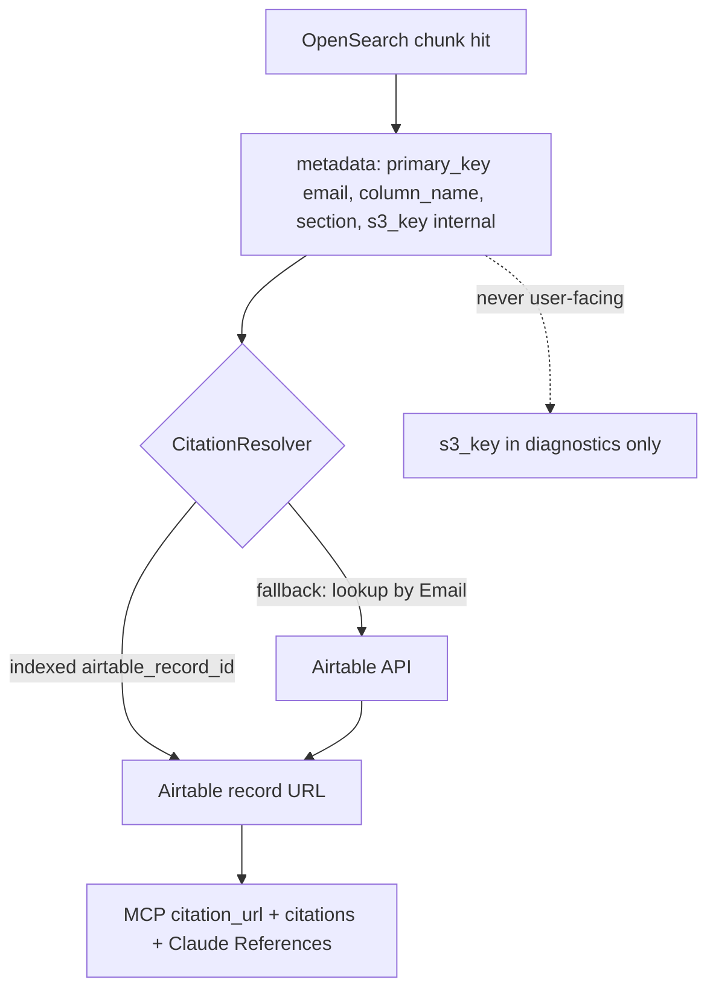
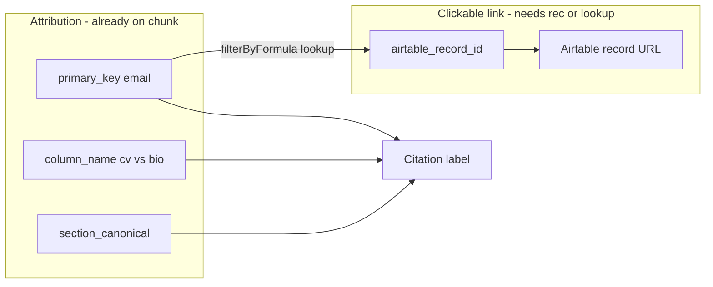
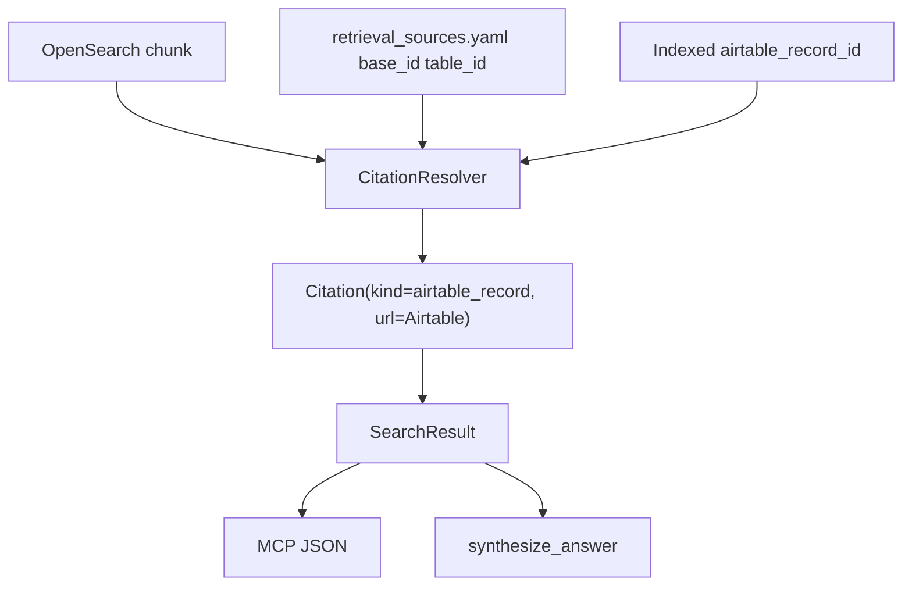

# Traceable citations for profile/document RAG

## User requirement (refined)

**S3 is not user-accessible** — raw `s3://` links must not appear in citations or Claude’s final answer.

**Desired flow for semantic search:**

1. Retrieve matched chunk from OpenSearch (KNN/BM25 + hydrate).
2. Use stored provenance (`primary_key`, `table_name`, `column_name`, optional `s3_key`) to identify the originating profile/document.
3. Map that identity to the **Airtable record** the user can open.
4. Expose **only the Airtable URL** (plus human label: person name, document column, CV section) in MCP JSON and synthesis.

**Answer: Yes, this works** — Airtable URLs need `rec…`. **Approved approach for Phase 1:** resolve `record_id` via **Airtable API** using indexed `primary_key` (email) + `identifier_field` from YAML (`Email` on Dalberg Profiles). Cache `(source, email) → record_id` per request so multiple CV/Bio chunks for one person share one lookup. Phase 3 (sidecar + reindex) remains an optimization to drop that API call.

---

## How the mapping works today vs target




| Step              | Already in codebase                                                                                                        | Notes                                                                         |
| ----------------- | -------------------------------------------------------------------------------------------------------------------------- | ----------------------------------------------------------------------------- |
| Chunk retrieval   | `[OpenSearchSource.search_semantic](src/retrieval/sources/opensearch.py)`                                                  | Returns `SearchResult` with `metadata` from `_SEMANTIC_METADATA_FIELDS`       |
| S3 identity       | `s3_key`, `s3_bucket`, `source_url` on every chunk — `[_to_action](src/pipeline/embedding_pipeline/indexer/opensearch.py)` | Used **internally** to trace which attachment was chunked; not shown to users |
| Business identity | `primary_key` (= email for profiles), `table_name`, `column_name`                                                          | Join key to Airtable row                                                      |
| Airtable URL      | Built today only for **structured** hits — `[airtable.py](src/retrieval/sources/airtable.py)`                              | Semantic hits: `citation_url` is still `null`                                 |


**S3 path layout** (from ingestion) already encodes the link:

`raw/{table_slug}/{email}/{column_slug}/{attachment}__normalized.txt`

So `primary_key` + `column_name` on the chunk is sufficient to know *which* document on *which* profile — the missing piece is `**rec…` for the URL**.

---

## Column-aware citations (CV vs Bio) — email + schema is enough for *attribution*

You are correct that for **Dalberg Profiles** we do not need S3 to tell Claude *which field* the evidence came from. That is already on every semantic chunk:


| Indexed field       | Example                             | Role                                    |
| ------------------- | ----------------------------------- | --------------------------------------- |
| `primary_key`       | `jane@dalberg.com`                  | Which person (row)                      |
| `column_name`       | `cv_attachment` (from S3 path slug) | Which attachment column — **CV vs Bio** |
| `section_canonical` | `experience`                        | Which section inside that document      |


Configured attachment columns (`[airtable_ingestion.yaml](config/airtable_ingestion.yaml)`): only **CV Attachment** and **Bio Attachment** are ingested for semantic search. So every semantic hit is implicitly one of those two sources.

**What email + column give you (no `rec…` required):**

- Citation **label**: `Jane Doe — CV Attachment (Experience)` or `… — Bio Attachment (Summary)`
- **Locator** in JSON: `{ "primary_key", "attachment_column": "CV Attachment", "section": "experience" }`
- Resolver maps S3 slug → display name via a small map, e.g. `cv_attachment` → `CV Attachment` (from YAML `attachment_columns`)

**What email + column do *not* give you:**

- A **clickable** Airtable URL. The path `https://airtable.com/{base}/{table}/{record_id}` requires `rec…`. Email is not accepted in that URL.

So there are two separate concerns:




**Airtable “point to specific column” in the UI:**

- Standard share links open the **record** (whole row). They do not reliably deep-link to a single field the way `#anchor` works on a web page.
- Best practice: one **record URL** + label/locator states **CV Attachment** vs **Bio Attachment** and section. The user opens the profile and sees the relevant attachment field on that row.
- Optional later: store Airtable `fieldId` (`fld…`) in sidecar metadata for internal tooling; only add to public URL if you validate a stable field-focus pattern for your base.

**Implication for implementation:**

- **Phase 1 (no reindex):** Use `column_name` + `section_canonical` for rich labels immediately; use query-time Airtable lookup `{Email} = primary_key` once per person to get `rec…` and set `citation_url`.
- **Phase 3 (reindex):** Same labels; `airtable_record_id` on chunk removes the lookup.

Do **not** conflate “which column” (solved by indexed metadata) with “build URL” (needs `rec…`).

---

## Citation policy (updated)


| Field / concept                                    | User-facing?                       | Purpose                                           |
| -------------------------------------------------- | ---------------------------------- | ------------------------------------------------- |
| `citation_url` / `citations[].url`                 | Yes — **Airtable only**            | Clickable source for Claude and MCP clients       |
| `citations[].label`                                | Yes                                | e.g. `Jane Doe — CV Attachment (Experience)`      |
| `locator.section_canonical`, `locator.column_name` | Yes (in label/locator, not as URL) | Shows *which part* of the profile was used        |
| `s3_key`, `source_url`                             | **No**                             | `SearchResponse.diagnostics` / internal logs only |
| `opensearch_chunk`                                 | Internal                           | `chunk_id` for support/debug                      |


Remove **optional S3 presign** from scope — not needed if citations are Airtable-only.

---

## Resolving semantic hit → clickable Airtable URL

### A. Query-time Airtable API (Phase 1 — ship first)

**User decision:** Use an Airtable API call when needed to get `record_id` from email.

After `search_semantic` builds hits (post-dedup is ideal — one lookup per person):

1. Collect unique `primary_key` values from hits missing `metadata.airtable_record_id`.
2. For each, call existing `[AirtableSource](src/retrieval/sources/airtable.py)` / connector with:
  - `formula`: `{Email} = 'user@dalberg.com'` (field name from `identifier_field` in `[retrieval_sources.yaml](config/retrieval_sources.yaml)`)
  - `max_records`: 1
  - `fields`: minimal (e.g. `Email`, `Display Name`) — optional, for richer labels
3. Read `row["id"]` → build `https://airtable.com/{base_id}/{table_id}/{record_id}` using `base_id` + `table_id` from source config / schema snapshot (already used for structured citations).
4. Set `SearchResult.citation_url` and `citations[]` on every hit sharing that `primary_key`.

**Caching:** In-memory dict on `CitationResolver` scoped to one MCP request (or `asyncio` task-local) — avoids N API calls when top-10 hits are 10 sections of 3 people.

**Failure handling:** If lookup fails (no row, rate limit, PAT error), leave `citation_url` null but keep label with email + column + section; log in `diagnostics.citation_resolve_failed`.

**Cost/latency:** ~1 Airtable round-trip per unique person per query (typically 1–5), acceptable for `search` / `semantic_search`.

**Auth — use your existing PAT (not legacy API keys):**

- Env: `AIRTABLE_PAT_TOKEN` (aliases `PAT_TOKEN` / legacy `AIRTABLE_API_KEY` in `[retrieval/settings.py](src/retrieval/settings.py)`) — same token already used by `airtable_lookup`, ingestion, and NL planner.
- Airtable deprecated **API keys** in 2024; **personal access tokens** are the supported method. Your PAT is exactly what Phase 1 needs.
- Required scopes on the token: `**data.records:read`** (email→record lookup). `**schema.bases:read**` if `get_schema` loads from Meta API without a snapshot file.
- Token must have access to the base in `[retrieval_sources.yaml](config/retrieval_sources.yaml)` (`BASE_ID` / `base_id` for `dalberg_profiles`).

### B. Index-time (Phase 3 — optimization)

At Airtable ingestion, when each attachment is uploaded to S3, write a sidecar `.meta.json`:

```json
{
  "airtable_record_id": "recXXXXXXXX",
  "airtable_base_id": "app…",
  "airtable_table_id": "tbl…",
  "identifier": "user@dalberg.com",
  "column_name": "CV Attachment"
}
```

Embedding pipeline reads sidecar → indexes `airtable_record_id` (+ optional base/table ids) on every chunk.

At retrieval, `CitationResolver` builds:

`https://airtable.com/{base_id}/{table_id}/{record_id}`

**Pros:** No Airtable API on every search after backfill.  
**Cons:** Requires re-ingest + re-index for existing profiles.

**Plan:** Phase 1 = **query-time API (A)**. Phase 3 = **index `airtable_record_id` (B)**; resolver skips API when field is present.

---

## Target architecture




### 1. Core data model

`[src/retrieval/models.py](src/retrieval/models.py)`:

```python
@dataclass(slots=True)
class Citation:
    cite_id: str
    kind: Literal["airtable_record", "document_section"]  # no s3_document in user API
    label: str          # "Jane Doe — CV (Experience)"
    url: str | None     # Airtable record URL only
    locator: dict       # record_id, column_name, section_canonical, chunk_id; s3_key optional internal
```

- `SearchResult.citation_url` = primary Airtable URL (backward compatible).
- `SearchResult.citations` = typically one `airtable_record` + optional `document_section` (section in label/locator, same URL).
- `SearchResult.to_dict()` must **omit** `s3_key` / `source_url` from `metadata` in the default envelope (or redact to null). Keep full metadata in `diagnostics` if needed for ops.

### 2. CitationResolver (`[src/retrieval/citations.py](src/retrieval/citations.py)`)


| Hit type       | Resolution                                                                                                                                                                                                                                                                           |
| -------------- | ------------------------------------------------------------------------------------------------------------------------------------------------------------------------------------------------------------------------------------------------------------------------------------ |
| **structured** | Existing: `record_id` + `base_id` + `table_id` from adapter                                                                                                                                                                                                                          |
| **semantic**   | 1) Label: map `column_name` slug → `CV Attachment` / `Bio Attachment` + `section_canonical`. 2) URL: if `airtable_record_id` indexed, build link; else one Airtable lookup per `primary_key` (email). Same record URL for CV and Bio hits on same person; label distinguishes column |


**Never set `citation.url` to `s3://…`.**

Wire into `[opensearch.py](src/retrieval/sources/opensearch.py)` and `[airtable.py](src/retrieval/sources/airtable.py)`.

### 3. Indexing changes (Phase 3)


| Field                | Type    | Purpose                                           |
| -------------------- | ------- | ------------------------------------------------- |
| `airtable_record_id` | keyword | Build user-facing URL                             |
| `airtable_base_id`   | keyword | Optional; can also come from YAML at resolve time |
| `airtable_table_id`  | keyword | Optional; from sidecar or schema snapshot         |


Keep existing `s3_key` / `source_url` in index for **pipeline/debug only** — not serialized to MCP by default.

Files: `[airtable_ingestion/pipeline.py](src/pipeline/airtable_ingestion/pipeline.py)`, `[s3_reader.py](src/pipeline/embedding_pipeline/reader/s3_reader.py)`, `[indexer/opensearch.py](src/pipeline/embedding_pipeline/indexer/opensearch.py)`, `[mappings.py](src/pipeline/embedding_pipeline/indexer/mappings.py)`.

### 4. MCP + Claude final response

`**semantic_search`** (no server synthesis): Claude reads `hits[].citation_url` and `hits[].citations` — must contain Airtable URLs only.

`**search`** (`synthesize_answer` in `[formatter.py](src/retrieval/formatter.py)`):

```
- Cite with [n] matching cite_id.
- References: label — Airtable URL only.
- Never cite or link to S3 paths.
- Use section/column from locator only to explain which part of the profile supported the claim.
```

Update MCP instructions in `[server.py](src/retrieval/mcp/server.py)` / `[tools.py](src/retrieval/mcp/tools.py)`.

Example user-facing reference:

`[1] Jane Doe — CV Attachment, Experience section — https://airtable.com/app…/tbl…/rec…`

### 5. Implementation phases


| Phase | Scope                                                                                                                       | Reindex? |
| ----- | --------------------------------------------------------------------------------------------------------------------------- | -------- |
| **1** | `CitationResolver` + **Airtable API email→rec lookup** + per-request cache + column-aware labels + redact S3 from `to_dict` | No       |
| **2** | Formatter prompts + MCP instructions + `references` dedupe by `record_id`                                                   | No       |
| **3** | Ingestion sidecar + index `airtable_record_id` + re-ingest profiles (skip API when indexed)                                 | Yes      |


### 6. Testing

- Semantic hit with indexed `airtable_record_id` → `citation_url` is valid Airtable link; JSON has no `s3://`.
- Semantic hit without `airtable_record_id` → fallback lookup returns same URL as opening profile in Airtable UI.
- `airtable_lookup` unchanged — already Airtable URLs.
- Claude answer from `search` includes References with Airtable links only.

---

## Files to touch


| File                                                                         | Change                                                |
| ---------------------------------------------------------------------------- | ----------------------------------------------------- |
| `[src/retrieval/models.py](src/retrieval/models.py)`                         | `Citation`, citations list, redacted `to_dict`        |
| **NEW** `[src/retrieval/citations.py](src/retrieval/citations.py)`           | Resolve semantic → Airtable URL                       |
| `[src/retrieval/sources/opensearch.py](src/retrieval/sources/opensearch.py)` | Attach citations; optional batch record-id resolution |
| `[src/retrieval/sources/airtable.py](src/retrieval/sources/airtable.py)`     | Use resolver                                          |
| `[src/retrieval/formatter.py](src/retrieval/formatter.py)`                   | Airtable-only synthesis rules                         |
| Ingestion + indexer files                                                    | Sidecar + `airtable_record_id` field                  |


Branch: `[feature/reranker-citations](feature/reranker-citations)` or `feature/citations`.