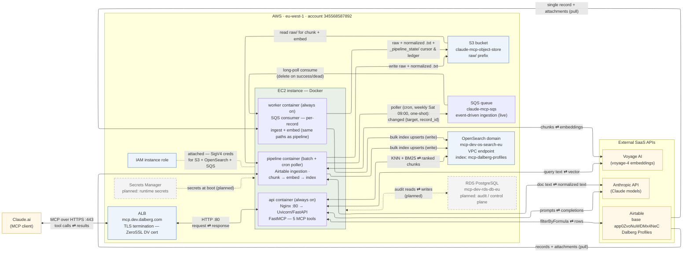

# AWS Infrastructure — Data Flow Diagram

How each AWS resource (and external SaaS dependency) exchanges data in the Dalberg MCP system.
Compiled from [architecture.md](architecture.md), [environment.md](environment.md), and [docker-ec2.md](docker-ec2.md).

**How to read the arrows**

- Arrows show the **direction data flows**, not who opens the connection.
- `⇄` (double arrow) — data moves in both directions over the link.
- `→` (single arrow) — data effectively moves one way.
- **Dashed grey** nodes/edges — provisioned or planned but **not wired in yet** (RDS, Secrets Manager).
- Who *initiates* each connection is listed in the table below (that's the view needed for security groups).

A pre-rendered PNG of this diagram is at [aws-infra-flow.png](aws-infra-flow.png).
**⚠️ The PNG is stale** — it predates feature 005 (SQS went live: cron poller → queue → worker container); regenerate it from the mermaid source below.

## Every link, with direction and initiator

| # | Link | Data direction | Initiated by | Protocol / port | What flows | Status |
|---|------|----------------|--------------|-----------------|------------|--------|
| 1 | Claude.ai ⇄ ALB | Bidirectional | Claude.ai | HTTPS 443 | MCP JSON-RPC tool calls in; SSE-framed results out | Live |
| 2 | ALB ⇄ EC2 (api) | Bidirectional | ALB | HTTP 80 | Forwarded requests / responses (Host header preserved) | Live |
| 3 | EC2 api ⇄ OpenSearch | Bidirectional | EC2 | HTTPS 443 (VPC endpoint) | KNN + BM25 queries out; ranked chunks back | Live |
| 4 | EC2 api ⇄ Airtable | Bidirectional | EC2 | HTTPS 443 | `filterByFormula` lookups out; structured rows back | Live |
| 5 | EC2 api ⇄ Anthropic API | Bidirectional | EC2 | HTTPS 443 | Planner / shape-classifier / synthesis prompts out; completions back (3 calls per `search`) | Live |
| 6 | EC2 api ⇄ Voyage AI | Bidirectional | EC2 | HTTPS 443 | Query text out; 1024-dim embedding back | Live |
| 7 | Airtable → EC2 (pipeline) | One-way (pull) | EC2 | HTTPS 443 | Records + CV/bio attachment binaries | Live (batch) |
| 8 | EC2 pipeline ⇄ Anthropic API | Bidirectional | EC2 | HTTPS 443 | Attachment text out; Claude-Haiku-normalized text back | Live (batch) |
| 9 | EC2 (pipeline) → S3 | One-way (write) | EC2 | HTTPS 443, SigV4 via IAM role | Raw binaries + `__normalized.txt` under `raw/` | Live (batch) |
| 10 | S3 → EC2 (pipeline) | One-way (read) | EC2 | HTTPS 443, SigV4 via IAM role | `raw/` objects for chunking + embedding | Live (batch) |
| 11 | EC2 pipeline ⇄ Voyage AI | Bidirectional | EC2 | HTTPS 443 | Child chunks out; embedding vectors back | Live (batch) |
| 12 | EC2 (pipeline) → OpenSearch | Mostly write (hash-check reads) | EC2 | HTTPS 443 (VPC endpoint) | Bulk upserts, `delete_by_s3_key`, `document_hash` checks | Live (batch) |
| 13 | IAM role — EC2 | Credential grant (not a data link) | — | Instance metadata | Temporary SigV4 credentials used for S3 + OpenSearch | Live |
| 14 | EC2 ⇄ RDS PostgreSQL | Bidirectional | EC2 | TCP 5432 | Pipeline audit / control-plane state | **Planned** |
| 15 | EC2 (pipeline, cron poller) → SQS | One-way (send) | EC2 (cron, weekly Sat 09:00) | HTTPS 443, SigV4 via IAM role | `{target, record_id}` messages for records whose watched attachment columns changed | Live |
| 16 | SQS → EC2 (worker) | One-way (consume) | EC2 (long-polls) | HTTPS 443, SigV4 via IAM role | Queued record ids; deleted on success/dead/poison-pill, redelivered on retry | Live |
| 17 | Airtable → EC2 (worker) | One-way (pull) | EC2 | HTTPS 443 | Single changed record + attachment binaries (allowlisted formats only) | Live |
| 18 | EC2 (worker) → S3 / OpenSearch | One-way (write) | EC2 | HTTPS 443, SigV4 via IAM role | Same artifacts as links 9/12, plus `_pipeline_state/` cursor + job ledger | Live |
| 19 | Secrets Manager → EC2 | One-way (read) | EC2 | HTTPS 443 | Runtime secrets for deployed environments | **Planned** |

**Note for security-group review:** every network connection is *initiated outbound from EC2* except links 1–2. Inbound rules needed: ALB accepts 443 from the internet; EC2 accepts 80 from the ALB target group only. OpenSearch is reachable only inside the VPC.
